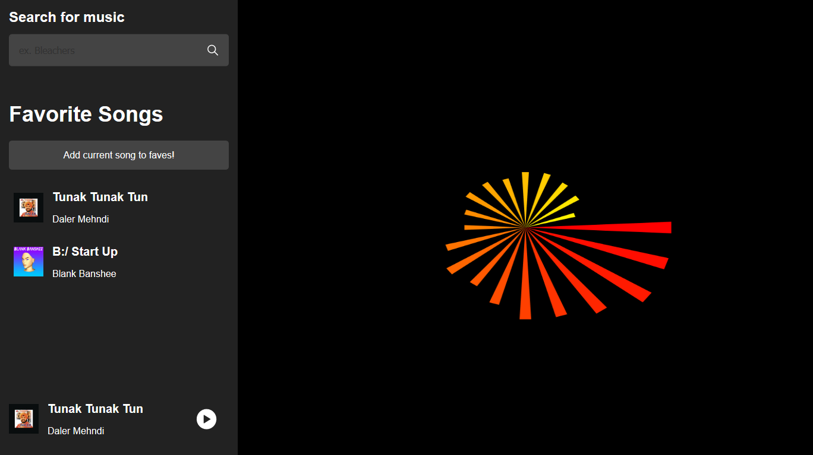

# Spotify Visualizer

Audio visualizer of Spotify songs using WebGL, with an aesthetic based on the era of Windows XP

https://spotify-vi.herokuapp.com/

By Ben Holmes and Michael Chen

Created for the class CS 4261: Mobile Apps and Services, Spring 2020.



## Getting started

```
npm install
npm run build
npm start
```

Create a MongoDB database, perhaps on MongoDB Atlas. Remember to whitelist your connection IP address. Copy `.env2` into a new `.env` file and replace the MongoDB <password> in `MONGODB_URI` with your actual one.

Create a Spotify developer application and replace `SPOTIFY_CLIENT_ID` and `SPOTIFY_CLIENT_SECRET` in your `.env`. Our developer application for this project can be found [here](https://developer.spotify.com/dashboard/applications/79c0dd6a3acc4717b59077af89aa572c).

In production, if you end up using cookies, you should change the `SESSION_SECRET` environment variable.

Sample database requests:

- GET localhost:3000/api/songs/get-faves
- POST localhost:3000/api/songs/fave?id=11dFghVXANMlKmJXsNCbNl
